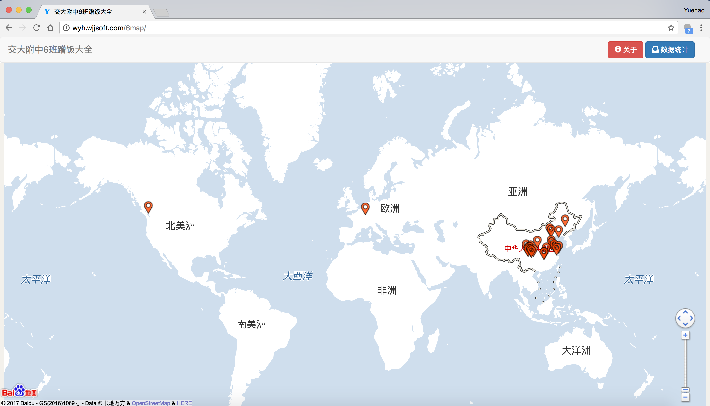
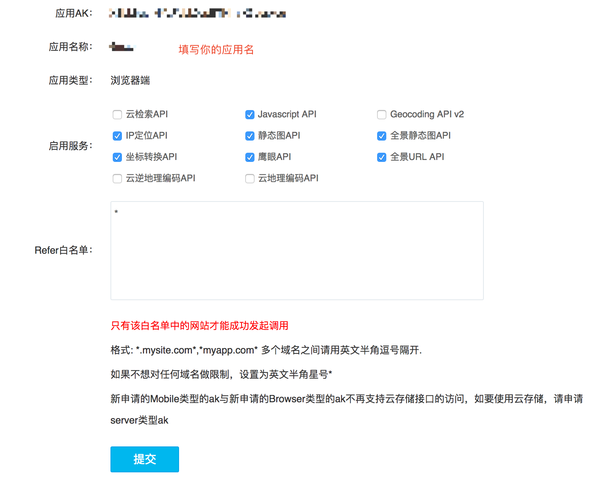

# 💖天府七中首届一班的蹭饭图💖
这里是更加直观的表格。
<table border="0" cellpadding="0" cellspacing="0" width="511" style="border-collapse:
 collapse;table-layout:fixed;width:380pt">
 <colgroup><col width="65" span="2" style="mso-width-source:userset;mso-width-alt:2201;
 width:48pt">
 <col width="186" style="mso-width-source:userset;mso-width-alt:6348;width:140pt">
 <col width="65" span="3" style="mso-width-source:userset;mso-width-alt:2201;
 width:48pt">
 </colgroup><tbody><tr height="19" style="height:13.9pt">
  <td colspan="2" height="19" class="xl65" width="130" style="height:13.9pt;width:96pt">省（国）/市</td>
  <td class="xl65" width="250" style="border-left:none;width:140pt">大学</td>
  <td colspan="3" class="xl65" width="195" style="border-left:none;width:144pt">　</td>
 </tr>
 <tr height="19" style="height:13.9pt">
  <td colspan="2" rowspan="5" height="95" class="xl67" style="height:69.5pt">北京</td>
  <td class="xl68" style="border-top:none;border-left:none">北京航空航天大学</td>
  <td class="xl69" style="border-top:none;border-left:none">谢铠舟</td>
  <td class="xl69" style="border-top:none;border-left:none">李雨桐</td>
  <td class="xl66" style="border-top:none;border-left:none">　</td>
 </tr>
 <tr height="19" style="height:13.9pt">
  <td height="19" class="xl68" style="height:13.9pt;border-top:none;border-left:
  none">中国科学院大学</td>
  <td class="xl69" style="border-top:none;border-left:none">邓思豪</td>
  <td class="xl66" style="border-top:none;border-left:none">　</td>
  <td class="xl66" style="border-top:none;border-left:none">　</td>
 </tr>
 <tr height="19" style="height:13.9pt">
  <td height="19" class="xl68" style="height:13.9pt;border-top:none;border-left:
  none">北京大学</td>
  <td class="xl69" style="border-top:none;border-left:none">郑睿恒</td>
  <td class="xl69" style="border-top:none;border-left:none">张楚媛</td>
  <td class="xl66" style="border-top:none;border-left:none">　</td>
 </tr>
 <tr height="19" style="height:13.9pt">
  <td height="19" class="xl68" style="height:13.9pt;border-top:none;border-left:
  none">北京大学医学部</td>
  <td class="xl69" style="border-top:none;border-left:none">朱映羲</td>
  <td class="xl66" style="border-top:none;border-left:none">　</td>
  <td class="xl66" style="border-top:none;border-left:none">　</td>
 </tr>
 <tr height="19" style="height:13.9pt">
  <td height="19" class="xl68" style="height:13.9pt;border-top:none;border-left:
  none">中国人民公安大学</td>
  <td class="xl69" style="border-top:none;border-left:none">陈宪</td>
  <td class="xl66" style="border-top:none;border-left:none">　</td>
  <td class="xl66" style="border-top:none;border-left:none">　</td>
 </tr>
 <tr height="19" style="height:13.9pt">
  <td colspan="2" rowspan="2" height="38" class="xl67" style="height:27.8pt">上海</td>
  <td class="xl68" style="border-top:none;border-left:none">上海交通大学</td>
  <td class="xl69" style="border-top:none;border-left:none">王渊弼</td>
  <td class="xl69" style="border-top:none;border-left:none">周钰琦</td>
  <td class="xl69" style="border-top:none;border-left:none">江恺兮</td>
 </tr>
 <tr height="19" style="height:13.9pt">
  <td height="19" class="xl68" style="height:13.9pt;border-top:none;border-left:
  none">同济大学</td>
  <td class="xl69" style="border-top:none;border-left:none">刘晓冬</td>
  <td class="xl69" style="border-top:none;border-left:none">马源胜</td>
  <td class="xl69" style="border-top:none;border-left:none">方舒雅</td>
 </tr>
 <tr height="19" style="height:13.9pt">
  <td height="19" class="xl65" style="height:13.9pt;border-top:none">江苏</td>
  <td class="xl65" style="border-top:none;border-left:none">南京</td>
  <td class="xl68" style="border-top:none;border-left:none">南京大学</td>
  <td class="xl69" style="border-top:none;border-left:none">何衍泽</td>
  <td class="xl69" style="border-top:none;border-left:none">梁一铭</td>
  <td class="xl66" style="border-top:none;border-left:none">　</td>
 </tr>
 <tr height="19" style="height:13.9pt">
  <td rowspan="6" height="114" class="xl65" style="height:83.4pt;border-top:none">广东</td>
  <td rowspan="3" class="xl65" style="border-top:none">深圳</td>
  <td class="xl68" style="border-top:none;border-left:none">香港中文大学(深圳）</td>
  <td class="xl69" style="border-top:none;border-left:none">罗雪菲</td>
  <td class="xl66" style="border-top:none;border-left:none">　</td>
  <td class="xl66" style="border-top:none;border-left:none">　</td>
 </tr>
 <tr height="19" style="height:13.9pt">
  <td height="19" class="xl68" style="height:13.9pt;border-top:none;border-left:
  none">南方科技大学</td>
  <td class="xl69" style="border-top:none;border-left:none">王彦儒</td>
  <td class="xl69" style="border-top:none;border-left:none">　</td>
  <td class="xl66" style="border-top:none;border-left:none">　</td>
 </tr>
 <tr height="19" style="height:13.9pt">
  <td height="19" class="xl68" style="height:13.9pt;border-top:none;border-left:
  none">中山大学（深圳）</td>
  <td class="xl69" style="border-top:none;border-left:none">宿培娴</td>
  <td class="xl66" style="border-top:none;border-left:none">　</td>
  <td class="xl66" style="border-top:none;border-left:none">　</td>
 </tr>
 <tr height="19" style="height:13.9pt">
  <td rowspan="2" height="38" class="xl65" style="height:27.8pt;border-top:none">广州</td>
  <td class="xl68" style="border-top:none;border-left:none">华南理工大学</td>
  <td class="xl69" style="border-top:none;border-left:none">徐浩然</td>
  <td class="xl66" style="border-top:none;border-left:none">　</td>
  <td class="xl66" style="border-top:none;border-left:none">　</td>
 </tr>
 <tr height="19" style="height:13.9pt">
  <td height="19" class="xl68" style="height:13.9pt;border-top:none;border-left:
  none">中山大学（广州）</td>
  <td class="xl69" style="border-top:none;border-left:none">彭昊楠</td>
  <td class="xl66" style="border-top:none;border-left:none">　</td>
  <td class="xl66" style="border-top:none;border-left:none">　</td>
 </tr>
 <tr height="19" style="height:13.9pt">
  <td height="19" class="xl65" style="height:13.9pt;border-top:none;border-left:
  none">珠海</td>
  <td class="xl68" style="border-top:none;border-left:none">中山大学（珠海）</td>
  <td class="xl69" style="border-top:none;border-left:none">黄腾中</td>
  <td class="xl66" style="border-top:none;border-left:none">　</td>
  <td class="xl66" style="border-top:none;border-left:none">　</td>
 </tr>
 <tr height="19" style="height:13.9pt">
  <td rowspan="2" height="38" class="xl65" style="height:27.8pt;border-top:none">四川</td>
  <td rowspan="2" class="xl67" style="border-top:none">成都</td>
  <td class="xl68" style="border-top:none;border-left:none">四川大学（江安校区）</td>
  <td class="xl69" style="border-top:none;border-left:none">钟思雨</td>
  <td class="xl66" style="border-top:none;border-left:none">　</td>
  <td class="xl66" style="border-top:none;border-left:none">　</td>
 </tr>
 <tr height="19" style="height:13.9pt">
  <td height="19" class="xl68" style="height:13.9pt;border-top:none;border-left:
  none">电子科技大学（清水河校区）</span></td>
  <td class="xl69" style="border-top:none;border-left:none">潘思颖</td>
  <td class="xl69" style="border-top:none;border-left:none">林晟周</td>
  <td class="xl66" style="border-top:none;border-left:none">　</td>
 </tr>
 <tr height="19" style="height:13.9pt">
  <td rowspan="3" height="57" class="xl65" style="height:41.7pt;border-top:none">湖北</td>
  <td rowspan="3" class="xl65" style="border-top:none">武汉</td>
  <td class="xl68" style="border-top:none;border-left:none">华中科技大学</td>
  <td class="xl69" style="border-top:none;border-left:none">李语心</td>
  <td class="xl69" style="border-top:none;border-left:none">宋孟阳</td>
  <td class="xl66" style="border-top:none;border-left:none">　</td>
 </tr>
 <tr height="19" style="height:13.9pt">
  <td height="19" class="xl68" style="height:13.9pt;border-top:none;border-left:
  none">武汉大学</td>
  <td class="xl69" style="border-top:none;border-left:none">曹子宸</td>
  <td class="xl66" style="border-top:none;border-left:none">　</td>
  <td class="xl66" style="border-top:none;border-left:none">　</td>
 </tr>
 <tr height="19" style="height:13.9pt">
  <td height="19" class="xl68" style="height:13.9pt;border-top:none;border-left:
  none">中国地质大学（武汉）</td>
  <td class="xl69" style="border-top:none;border-left:none">李宛秋</td>
  <td class="xl66" style="border-top:none;border-left:none">　</td>
  <td class="xl66" style="border-top:none;border-left:none">　</td>
 </tr>
 <tr height="19" style="height:13.9pt">
  <td rowspan="3" height="57" class="xl65" style="height:41.7pt;border-top:none">陕西</td>
  <td rowspan="3" class="xl65" style="border-top:none">西安</td>
  <td class="xl68" style="border-top:none;border-left:none">西北工业大学</td>
  <td class="xl69" style="border-top:none;border-left:none">胡怡凡</td>
  <td class="xl66" style="border-top:none;border-left:none">　</td>
  <td class="xl66" style="border-top:none;border-left:none">　</td>
 </tr>
 <tr height="19" style="height:13.9pt">
  <td height="19" class="xl68" style="height:13.9pt;border-top:none;border-left:
  none">西安交通大学</td>
  <td class="xl69" style="border-top:none;border-left:none">章雪雁</td>
  <td class="xl66" style="border-top:none;border-left:none">　</td>
  <td class="xl66" style="border-top:none;border-left:none">　</td>
 </tr>
 <tr height="19" style="height:13.9pt">
  <td height="19" class="xl68" style="height:13.9pt;border-top:none;border-left:
  none">西安电子科技大学</td>
  <td class="xl69" style="border-top:none;border-left:none">张雨阳</td>
  <td class="xl66" style="border-top:none;border-left:none">　</td>
  <td class="xl66" style="border-top:none;border-left:none">　</td>
 </tr>
 <tr height="19" style="height:13.9pt">
  <td rowspan="2" height="38" class="xl65" style="height:27.8pt;border-top:none">山东</td>
  <td class="xl65" style="border-top:none;border-left:none">威海</td>
  <td class="xl68" style="border-top:none;border-left:none">哈尔滨工业大学（威海）</td>
  <td class="xl69" style="border-top:none;border-left:none">青哮添</td>
  <td class="xl66" style="border-top:none;border-left:none">　</td>
  <td class="xl66" style="border-top:none;border-left:none">　</td>
 </tr>
 <tr height="19" style="height:13.9pt">
  <td height="19" class="xl65" style="height:13.9pt;border-top:none;border-left:
  none">济南</td>
  <td class="xl68" style="border-top:none;border-left:none">山东大学</td>
  <td class="xl69" style="border-top:none;border-left:none">刘恩荣</td>
  <td class="xl66" style="border-top:none;border-left:none">　</td>
  <td class="xl66" style="border-top:none;border-left:none">　</td>
 </tr>
 <tr height="19" style="height:13.9pt">
  <td height="19" class="xl65" style="height:13.9pt;border-top:none">辽宁</td>
  <td class="xl65" style="border-top:none;border-left:none">沈阳</td>
  <td class="xl68" style="border-top:none;border-left:none">东北大学</td>
  <td class="xl69" style="border-top:none;border-left:none">陈里函</td>
  <td class="xl66" style="border-top:none;border-left:none">　</td>
  <td class="xl66" style="border-top:none;border-left:none">　</td>
 </tr>
 <tr height="19" style="height:13.9pt">
  <td height="19" class="xl65" style="height:13.9pt;border-top:none">浙江</td>
  <td class="xl65" style="border-top:none;border-left:none">宁波</td>
  <td class="xl68" style="border-top:none;border-left:none">宁波诺丁汉大学</td>
  <td class="xl69" style="border-top:none;border-left:none">温博凯</td>
  <td class="xl66" style="border-top:none;border-left:none">　</td>
  <td class="xl66" style="border-top:none;border-left:none">　</td>
 </tr>
 <tr height="19" style="height:13.9pt">
  <td height="19" class="xl65" style="height:13.9pt;border-top:none">安徽</td>
  <td class="xl65" style="border-top:none;border-left:none">合肥</td>
  <td class="xl68" style="border-top:none;border-left:none">中国科学技术大学</td>
  <td class="xl69" style="border-top:none;border-left:none">孙若尧</td>
  <td class="xl66" style="border-top:none;border-left:none">　</td>
  <td class="xl66" style="border-top:none;border-left:none">　</td>
 </tr>
 <tr height="19" style="height:13.9pt">
  <td colspan="2" height="19" class="xl65" style="height:13.9pt">重庆</td>
  <td class="xl68" style="border-top:none;border-left:none">重庆大学</td>
  <td class="xl69" style="border-top:none;border-left:none">邹亦峰</td>
  <td class="xl66" style="border-top:none;border-left:none">　</td>
  <td class="xl66" style="border-top:none;border-left:none">　</td>
 </tr>
 <tr height="19" style="height:13.9pt">
  <td height="19" class="xl65" style="height:13.9pt;border-top:none">英国</td>
  <td class="xl65" style="border-top:none;border-left:none">伦敦</td>
  <td class="xl68" style="border-top:none;border-left:none">帝国理工学院</td>
  <td class="xl69" style="border-top:none;border-left:none">朱梅可芸</td>
  <td class="xl66" style="border-top:none;border-left:none">　</td>
  <td class="xl66" style="border-top:none;border-left:none">　</td>
 </tr>
 <!--[endif]-->
</tbody></table>

## 使用说明
网页是https://hab1na.github.io/

所有同学的大学地理位置已经按城市划分

可用鼠标滚轮放大

放大到一定程度后会显示各个大学的具体位置

左下角有个音乐播放器，但是你们并不能自己选歌🤣

（我编不出来了）


## 制作指南

什么？找我要指南？

我就是个菜鸡啥都写不来😥

感谢github上面的大佬愿意写出我这种菜鸡能看得懂的教程

让我当了一回无情填数据机器

修改地图初始定位点以及初始缩放需在main.js中进行

感谢Yuehao大佬：https://github.com/yuehaowang/irmap

这里是他的教程：

# irmap

## 简介

IRMap (Ideal Reality Map) 是一个用来做高中毕业去向的工具。基于Bootstrap和百度地图。兼容各大主流浏览器，iOS，Android，以及QQ和微信等平台。

以下是示例展示：

- ### 6map



在线地址：[http://yuehaolab.com/apps/6map/](http://yuehaolab.com/apps/6map/)


## 如何使用？

你只用在index.html中添加你的百度地图AK码以及更改config.js文件里的内容就能完成整个地图的生成。

### 获取百度地图开放平台AK码

关于如何获取百度地图AK码，其实很简单，直接去[百度地图开放平台](http://lbsyun.baidu.com/)里点击“申请密钥”，然后填写一个申请表。申请表比照下图填写，填写之后提交就能获取AK码了：



用文本编辑器打开index.html，将这个密钥填写在index.html的下图所示位置并保存文件：

```html
<script type="text/javascript" src="http://api.map.baidu.com/api?v=2.0&ak=亲，密钥填这里"></script>
```

注意：如果你的发布平台支持HTTPS协议，请将上面链接中"http"部分改为"https"。

### 更改config.js

之后更改config.js。示例如下：

```javascript
var MAP_STYLE = "hardedge";

var DATA = {
	"城市1" : {
		"大学A" : ["Peter", "Mary"],
		"大学B" : ["Tony", "Pepper"]
	},

	"城市2" : {
		"大学C" : ["Stephen", "Klay", "Kevin"],
		"大学D" : ["Lebron"]
	}
};

var SPEC_POS = {
	"大学C" : [121.597479, 31.185356]
};

var MAP_TITLE = "毕业去向";

var ABOUT = {
	"作者" : ["Yuehao"],
	"框架" : ["irmap", "Bootstrap", "百度地图"]
};
```

这个文件会被自动引进项目中，所以不要更改这个文件的名字和位置，其中定义的变量将会在项目中被使用。以下介绍其中定义的变量：

- MAP_STYLE 地图样式，参考[样式列表](http://developer.baidu.com/map/custom/list.htm)。
- DATA 学校数据，[JSON](http://www.json.org/json-zh.html)格式。格式参考上面的示例。地图上的地标根据这个变量里的内容自动定位。
- SPEC_POS 一些学校（比如国外的学校）的位置百度地图无法通过搜索定位，或者定位有误，更改这个属性可以设置学校的经纬度从而辅助定位。（百度地图开放平台提供了一个拾取经纬度的工具，见[百度地图坐标拾取系统](http://api.map.baidu.com/lbsapi/getpoint/index.html)）
- MAP_TITLE 地图标题。
- ABOUT 关于界面中的内容。格式：`{"标题" : ["第一行内容", "第二行内容"]}`。

更改完成后，保存config.js文件，用浏览器打开index.html就能看到结果。

## 发布地图

推荐使用Github Pages发布你所制作完成的地图。你也可以使用自己的服务器，并以静态页面的形式发布地图。

## 音乐播放器（这不是教程内容）

来源于此：https://blog.csdn.net/weixin_44081211/article/details/124574902

## 开源协议（这不是教程内容）

遵守与原模版相同的GPL协议。
